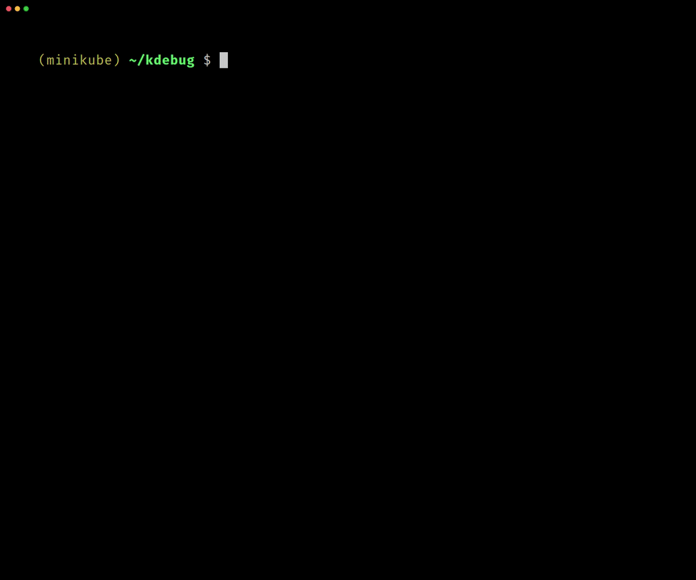
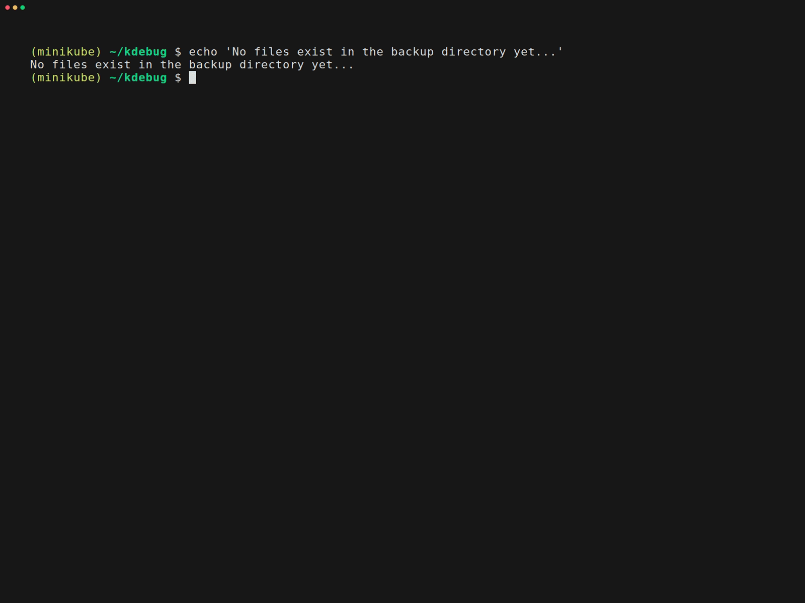

# kdebug

`kdebug` is a helper utility for launching ephemeral Kubernetes debug containers and backing up files. It provides interactive shell access, backup workflows, and a TUI for pod selection.

When the target container is missing the tools you need, `kdebug` shortens the `kubectl debug` and `kubectl cp` flow into easy to understand commands.

For example, to run a debug container to look at the Grafana filesystem, you'd need to know all of these details:

```sh
kubectl debug kube-prometheus-stack-grafana-d4f497446-kbqc8 \
  -n monitoring \
  -it \
  --target=grafana \
  --share-processes \
  --profile=general \
  --image=busybox \
  -- /bin/sh
```

And then, to get to the container's filesystem, you'd need to run `cd /proc/1/root/etc/grafana`.

Instead:

```sh
kdebug -n monitoring --cd-into /etc/grafana
```

tldr; install:

```sh
brew install jessegoodier/kdebug/kdebug
```

Similar to [kpf](https://github.com/jessegoodier/kpf), this is a Python wrapper around `kubectl debug` and `kubectl cp`.

> Notice: the default debug image is [ghcr.io/jessegoodier/toolbox-common:latest](https://github.com/jessegoodier/toolbox/tree/main/common). Override it with `--debug-image` or a global config file if that image is not appropriate for your needs.

## Features

- 🐚 **Interactive Shell Access** - Launch bash/sh sessions in debug containers directly to the directory of your choice
- 💾 **Backup Capabilities** - Copy files/directories from pods with optional compression and configurable local paths
- 🔍 **Multiple Selection Modes** - Direct pod, controller-based, or interactive TUI
- 🎯 **Smart Container Selection** - Auto-select containers or choose specific targets
- 📦 **Backup Size Estimates** - Understand how much data you backing up
- ⚙️ **Config File** - Set defaults for debug image, shell command, and backup paths
- 🔐 **Command Completion** - Automatically installed with brew, otherwise `--completion zsh/bash/fish`

<details open>
<summary>Demo of the debug TUI</summary>


</details>

<details open>
<summary>Demo of backups</summary>


</details>

## Installation

### Homebrew

```bash
brew install jessegoodier/kdebug/kdebug
```

### Python tools

```
# uv
uv tool install kdebug

# pip
pip install kdebug
```

## Usage

`kdebug` has two modes of operation:

```
kdebug debug [options]          # Interactive debug session (default)
kdebug backup [options]         # Backup files from pod
kdebug [options]                # Same as "kdebug debug"
```

### Global Options

These shared options work with both `debug` and `backup`:

```bash
# Use a specific context
kdebug --context minikube -n default --pod my-pod

# Use a different kubeconfig file
kdebug --kubeconfig .kubeconfig -n my-app

# Combine both options
kdebug --kubeconfig /path/to/config --context staging -n my-app --pod my-pod
```

### Interactive Mode (TUI)

When no pod or controller is specified, `kdebug` launches an interactive menu:

```bash
# Interactive mode - select from all resources in current namespace
kdebug

# Interactive mode with specific namespace
kdebug -n my-app
```

### Debug Subcommand

The `debug` subcommand, or bare `kdebug`, launches an interactive shell session in an ephemeral debug container.

```bash
# Interactive session with direct pod (bare usage = debug)
kdebug -n kubecost --pod aggregator-0 --container aggregator

# Explicit debug subcommand with custom shell
kdebug debug -n kubecost --pod aggregator-0 --cmd sh

# Auto-select first container if not specified
kdebug debug -n kubecost --pod aggregator-0

# Change to a directory on start
kdebug debug -n kubecost --pod aggregator-0 --cd-into /var/configs
```

**Debug-specific options:**

| Option | Description |
|---|---|
| `--cmd CMD` | Command to run in debug container (default: `bash`) |
| `--cd-into DIR` | Change to directory on start (via `/proc/1/root`) |

### Controller-Based Selection

Avoid the TUI and launch with direct commands:

```bash
# Using StatefulSet (sts)
kdebug --controller sts/aggregator --container aggregator

# Using Deployment
kdebug -n myapp --controller deploy/frontend --cmd sh

# Using DaemonSet
kdebug -n logging --controller ds/fluentd
```

**Supported Controller Types:**
- `deployment` or `deploy` - Kubernetes Deployments
- `statefulset` or `sts` - StatefulSets
- `daemonset` or `ds` - DaemonSets

### Backup Subcommand

The `backup` subcommand copies files or directories from a pod to your local machine.

This supports both copying files as is to the client, or optionally use tar+gz to compress the files in container before copying.

```bash
# Backup a directory (uncompressed)
kdebug backup -n kubecost --pod aggregator-0 --container-path /var/configs

# Backup with compression
kdebug backup -n kubecost --pod aggregator-0 --container-path /var/configs --compress

# Backup with a custom local path using template variables
kdebug backup --pod web-0 --container-path /var/data \
  --local-path ./my-backups/{namespace}/{pod}

# Backup using controller selection
kdebug backup --controller deploy/kubecost-local-store \
  --container-path /var/configs/localBucket_v002
```

**Backup-specific options:**

| Option | Description |
|---|---|
| `--container-path PATH` | **(required)** Path inside the container to back up |
| `--local-path TEMPLATE` | Local destination (default: `./backups/{namespace}/{date}_{pod}`) |
| `--compress` | Compress backup as tar.gz |
| `--tar-exclude PATH` | Exclude a path or pattern from the archive (repeatable) |

**Using `--tar-exclude`:**

Excludes are matched against paths inside the archive and can be repeated. Provide a name or relative pattern — **do not include the full container path prefix**:

```bash
# Exclude a single subdirectory by name
kdebug backup -n kubecost --pod aggregator-0 --container-path /var/configs \
  --compress --tar-exclude waterfowl

# Exclude multiple paths
kdebug backup -n kubecost --pod aggregator-0 --container-path /var/configs \
  --compress --tar-exclude waterfowl --tar-exclude tmp --tar-exclude '*.log'
```

**Template variables for `--local-path`:**

| Variable | Value |
|---|---|
| `{namespace}` | Kubernetes namespace |
| `{pod}` | Pod name |
| `{date}` | Timestamp (`YYYY-MM-DD_HH-MM-SS`) |
| `{container}` | Target container name |

### Run as Root

```bash
# Launch debug container as root user
kdebug -n myapp --pod frontend-abc123 --as-root
```

### Verbose Mode

```bash
# Show all kubectl commands being executed
kdebug -n myapp --pod frontend-abc123 --verbose
```

## Config File

kdebug supports a JSON config file at `~/.config/kdebug/kdebug.json` (respects `XDG_CONFIG_HOME`). CLI flags always take priority over config values.

```json
{
  "debugImage": "busybox:latest",
  "cmd": "sh",
  "cdInto": "/app",
  "backupContainerPath": "/var/data",
  "backupLocalPath": "./backups/{namespace}/{date}_{pod}"
}
```

| Key | Description | Default |
|---|---|---|
| `debugImage` | Debug container image | `ghcr.io/jessegoodier/toolbox-common:latest` |
| `cmd` | Shell command for debug sessions | `bash` |
| `cdInto` | Directory to cd into on start | *(none)* |
| `backupContainerPath` | Default container path for backups | *(none)* |
| `backupLocalPath` | Default local path template for backups | `./backups/{namespace}/{date}_{pod}` |

String values support `${ENV_VAR}` expansion:

```json
{
  "debugImage": "${MY_DEBUG_IMAGE}",
  "backupLocalPath": "${HOME}/kdebug-backups/{namespace}/{date}_{pod}"
}
```

### Example: Using busybox as debug image

If you don't need the full toolbox image, busybox is a lightweight alternative:

```json
{
  "debugImage": "busybox:latest",
  "cmd": "sh"
}
```

Since busybox doesn't include bash, set `cmd` to `sh`. With this config, simply run `kdebug --pod my-pod` and it will use busybox with sh automatically.

## Shell Completion

`kdebug` supports tab completion for bash, zsh, and fish with dynamic lookups for namespaces, pods, controller names, and contexts.

### Bash

```bash
# Add to ~/.bashrc
source <(kdebug --completions bash)
```

### Zsh

```bash
# Option 1: Source directly (add to ~/.zshrc)
source <(kdebug --completions zsh)

# Option 2: Install to fpath (recommended)
mkdir -p ~/.zsh/completions
kdebug --completions zsh > ~/.zsh/completions/_kdebug
# Add to ~/.zshrc before compinit:
fpath=(~/.zsh/completions $fpath)
autoload -Uz compinit && compinit
```

### Fish

```fish
# Load for current shell
kdebug --completions fish | source

# Or install permanently
kdebug --completions fish > ~/.config/fish/completions/kdebug.fish
```

### Completion Features

- `kdebug <TAB>` - Complete subcommands (`debug`, `backup`)
- `kdebug --<TAB>` - Complete shared options
- `kdebug debug --<TAB>` - Complete debug-specific options
- `kdebug backup --<TAB>` - Complete backup-specific options
- `kdebug -n <TAB>` - Complete namespace names from cluster
- `kdebug --pod <TAB>` - Complete pod names (respects -n flag)
- `kdebug --controller <TAB>` - Complete controller type/name pairs
- `kdebug --context <TAB>` - Complete context names from kubeconfig

## Examples

### Example 1: Interactive Pod Selection

```bash
$ kdebug -n production

Starting interactive pod selection...

══════════════════════════════════════════════════════════════════════
Select Pod in namespace: production
══════════════════════════════════════════════════════════════════════

▶ 1. frontend-abc123 (Running)
  2. frontend-def456 (Running)
  3. backend-ghi789 (Running)
  4. database-0 (Running)
  5. worker-jkl012 (Pending)

──────────────────────────────────────────────────────────────────────
Use ↑/↓ arrows or numbers to select, Enter to confirm, q to quit
──────────────────────────────────────────────────────────────────────
```

### Example 2: Quick Debug Session

```bash
# Launch debug container and get bash shell
kdebug -n kubecost --controller sts/aggregator --container aggregator

# Output:
# ══════════════════════════════════════════════════════════════════════
# Starting interactive session in pod aggregator-0
# Container: debugger-xyz
# Command: bash
# ══════════════════════════════════════════════════════════════════════
```

### Example 3: Backup with Custom Local Path

```bash
# Backup with compression to a custom path
kdebug backup -n production --pod api-server-0 \
  --container-path /etc/app/config \
  --local-path ./config-backups/{namespace}/{date}_{pod} \
  --compress

# Output:
# ══════════════════════════════════════════════════════════════════════
# Creating backup from pod api-server-0
# Container path: /etc/app/config
# Local path: ./config-backups/production/2024-02-04_10-30-45_api-server-0.tar.gz
# Mode: Compressed (tar.gz)
# ══════════════════════════════════════════════════════════════════════
# ✓ Path exists: /etc/app/config
# ✓ Backup archive created
# ✓ Backup saved to: ./config-backups/production/2024-02-04_10-30-45_api-server-0.tar.gz
```

## Color Scheme

kdebug uses a kubecolor-inspired color scheme:

- 🔵 **Blue** - Borders and separators
- 🟢 **Green** - Success messages and running status
- 🟡 **Yellow** - Warnings and pending status
- 🔴 **Red** - Errors and failed status
- 🟣 **Magenta** - Namespaces
- 🔷 **Cyan** - Pod and container names
- ⚪ **White/Gray** - General text and metadata

## Requirements

- Python 3.9+
- `rich` is installed automatically with the Python package
- kubectl configured with cluster access
- Kubernetes cluster with ephemeral containers support (v1.23+)

## How It Works

1. **Resource Discovery** - Queries Kubernetes API for controllers/pods
2. **Debug Container Launch** - Creates ephemeral container with debug image
3. **Process Sharing** - Enables `--share-processes` for full pod access
4. **Interactive Session** - Attaches to container with TTY
5. **Cleanup** - Terminates debug container after session ends

## Troubleshooting

### "Operation not supported on socket" Error

The interactive TUI requires a real terminal (TTY). Ensure you're running kdebug in:
- A standard terminal (not piped or redirected)
- Not through automation tools that don't provide TTY
- With proper terminal emulation support

### "Pod Security Policy" Warnings

If you see warnings about `runAsNonRoot`, the pod has security restrictions. Try:
- Running without `--as-root` flag
- Checking pod security policies
- Using a different debug image

### Container Won't Start

Check:
- Debug image is accessible from cluster
- Pod has sufficient resources
- Network policies allow image pull
- Use `--verbose` flag to see kubectl commands

## License

MIT

## Contributing

Contributions welcome! Please open issues or pull requests.

See [README-development.md](README-development.md) for local setup, linting, tests, and helper `just` commands.
